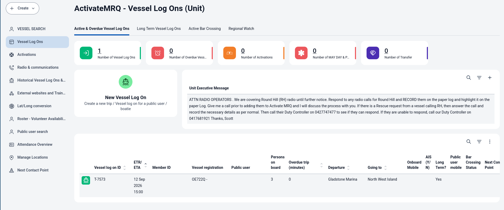
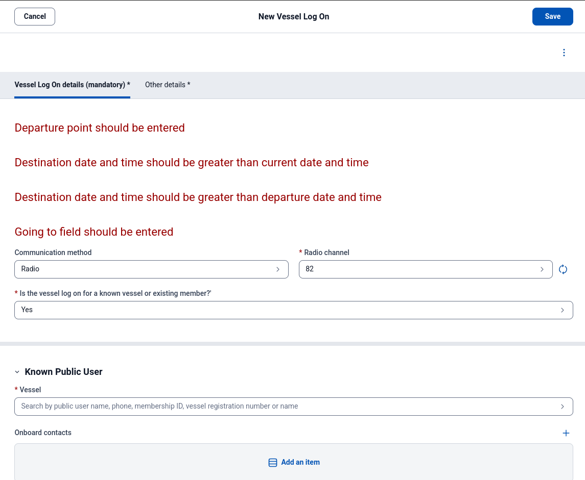
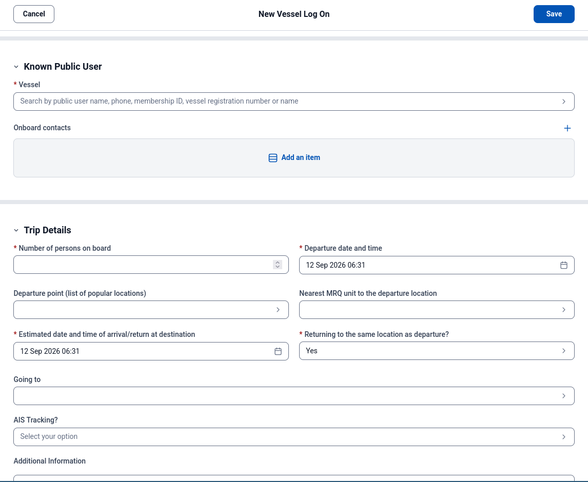
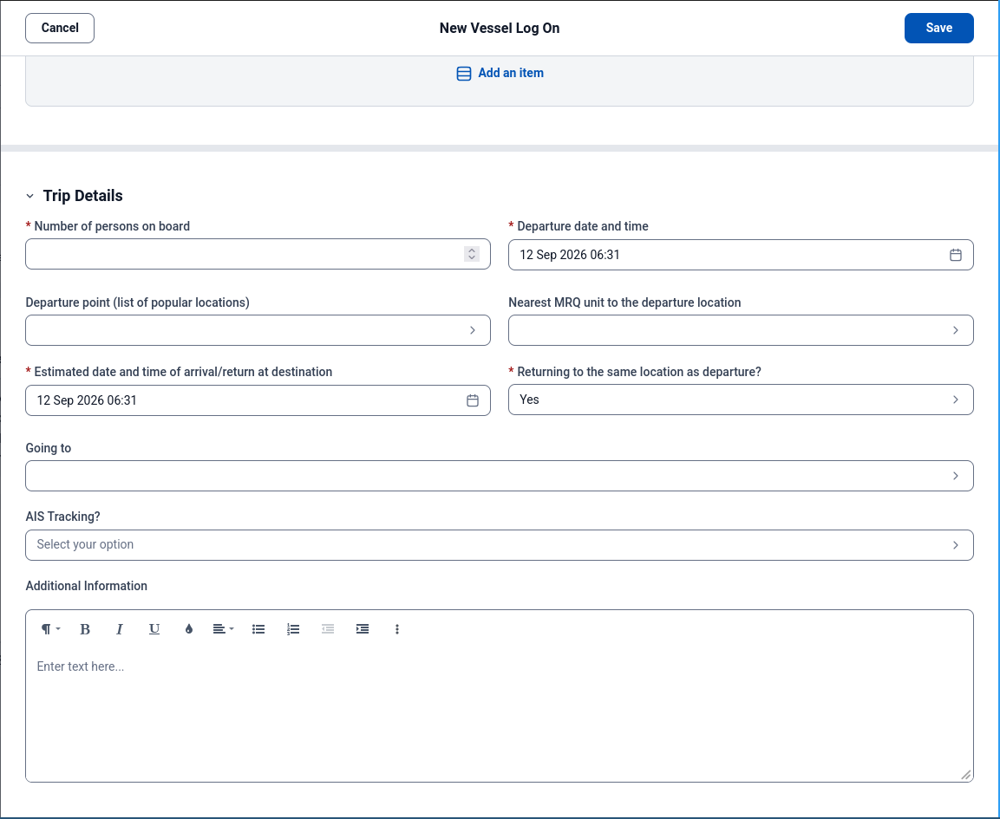

# Vessel Log On — Functional Specification

**Version:** 0.7 (draft) 
**Revised:** 12 September 2026 (AEST) 
**Status:** For operational review; not an approved operating procedure 
**Domain:** Marine rescue vessel log on, watch, and log off 
**Audience:** Anyone implementing or evaluating a system that performs this function

<!-- contents:start -->
## Table of contents

- [1. Purpose and scope](#section-1-purpose-and-scope)
    - [1.1 Purpose](#section-11-purpose)
    - [1.2 The primary safety objective](#section-12-the-primary-safety-objective)
    - [1.3 Scope](#section-13-scope)
    - [1.4 Priority](#section-14-priority)
    - [1.5 Requirement language](#section-15-requirement-language)
- [2. Definitions](#section-2-definitions)
- [3. Domain model](#section-3-domain-model)
    - [3.1 Entities](#section-31-entities)
    - [3.2 Relationships](#section-32-relationships)
    - [3.3 Capture, watch and escalation are separate](#section-33-capture-watch-and-escalation-are-separate)
    - [3.4 Log on variants and obligations](#section-34-log-on-variants-and-obligations)
- [4. Operating context](#section-4-operating-context)
- [5. Requirements — Capture (P1)](#section-5-requirements-capture-p1)
    - [5.1 Capture performance](#section-51-capture-performance)
    - [5.2 Persistence, interruption and concurrent work](#section-52-persistence-interruption-and-concurrent-work)
- [6. Requirements — Data (P1)](#section-6-requirements-data-p1)
    - [6.1 Field priority classes](#section-61-field-priority-classes)
- [7. Requirements — Identification, verification and search (P1)](#section-7-requirements-identification-verification-and-search-p1)
    - [7.1 Cross-verification](#section-71-cross-verification)
    - [7.2 Tolerant resolution](#section-72-tolerant-resolution)
    - [7.3 Search](#section-73-search)
- [8. Requirements — Watch and overdue (P2)](#section-8-requirements-watch-and-overdue-p2)
- [9. Requirements — Record and audit (P2)](#section-9-requirements-record-and-audit-p2)
- [10. Acceptance criteria](#section-10-acceptance-criteria)
    - [10.1 Capture](#section-101-capture)
    - [10.2 Verification and search](#section-102-verification-and-search)
    - [10.3 Watch, record and audit](#section-103-watch-record-and-audit)
    - [10.4 Adoption and release acceptance](#section-104-adoption-and-release-acceptance)
    - [10.5 Interrupted and exceptional operation](#section-105-interrupted-and-exceptional-operation)
    - [10.6 Operational release gate](#section-106-operational-release-gate)
- [Appendix A — Justification from current practice](#section-appendix-a-justification-from-current-practice)
- [Appendix B — Letter confusion set](#section-appendix-b-letter-confusion-set)
- [Appendix C — Traceability from version 0.3](#section-appendix-c-traceability-from-version-03)
- [Appendix D — Open questions](#section-appendix-d-open-questions)
- [Appendix E — Revision history](#section-appendix-e-revision-history)
    - [Version 0.7 — changes from 0.6](#section-version-07-changes-from-06)
    - [Version 0.6 — changes from 0.5](#section-version-06-changes-from-05)
    - [Version 0.5 — changes from 0.4](#section-version-05-changes-from-04)
- [Appendix F — Evidence figures](#section-appendix-f-evidence-figures)
    - [Figure 1 — Active log on list](#section-figure-1-active-log-on-list)
    - [Figure 2 — Validation error block](#section-figure-2-validation-error-block)
    - [Figure 3 — Capture form scrolled](#section-figure-3-capture-form-scrolled)
    - [Figure 4 — Trip-detail defaults](#section-figure-4-trip-detail-defaults)
<!-- contents:end -->

---

## 1. Purpose and scope

### 1.1 Purpose

This document specifies the required behaviour of a system that records vessels departing
under the watch of a marine rescue unit, monitors their safe return, and escalates when
they do not return.

It is written to be implementation-independent. It names no product and assumes no
technology. It is equally usable as a build specification and as an evaluation checklist
for an existing system.

### 1.2 The primary safety objective

All requirements in this document derive from one objective:

> **PSO.** If a vessel does not return when it said it would, the unit shall know, and
> the unit shall be able to find it.

PSO expresses the intended outcome; software cannot guarantee that a vessel will be found.
Its testable contribution is to preserve the information received, expose missing or
uncertain information, detect missed obligations, and retain an accountable watch owner.

Conflicting requirements shall be resolved explicitly during review, with the decision
recorded against PSO. Implementers shall not silently waive a requirement by invoking PSO.

### 1.3 Scope

**In scope:** capture of log on details across all channels; identification and
verification of vessels and persons; search across unit records; monitoring of active
log ons; overdue detection and escalation; log off; amendment; record retention and
audit.

**Out of scope:** conduct of the search or rescue itself; asset and crew management;
member administration and billing; incident management beyond the point of escalation.

### 1.4 Priority

Requirements carry a priority reflecting current operational need, not importance:

| Priority | Meaning |
|---|---|
| **P1** | Primary focus. Capture and verification of radio log ons — §5, §6, §7. |
| **P2** | Required, but adequately served by existing practice — §8, §9. |
| **P3** | Required for completeness; lowest urgency. No requirement in this revision carries P3. |

P2 means lower change urgency in the existing operation, not an optional release gate.
A replacement capture system shall demonstrate a functioning path into the existing watch
or implement the required watch behavior before it is relied on operationally. A saved
record alone is not evidence that anyone is monitoring it.

### 1.5 Requirement language

**Shall** — mandatory. **Should** — strongly recommended; deviation requires
justification. **May** — optional.

---

## 2. Definitions

| Term | Definition |
|---|---|
| **Log on** | A record that a vessel has departed under the unit's watch, with a stated intention to return by a stated time. |
| **Log off** | The act of closing a log on because the vessel has returned or otherwise ended its trip. |
| **Operator** | A person, usually a volunteer, receiving log ons at a unit. |
| **Unit** | A marine rescue base holding the watch for a geographic area. |
| **Member** | A person with a standing record held by the organisation. |
| **Public user** | A person without a standing record, logging on as a non-member. |
| **Identifier** | A captured identifying value, whether or not it resolves: member number, vessel registration, mobile number, vessel name, person name. |
| **Verification** | Evidence that independently supplied identifiers consistently identify a stored person/vessel association; not proof of the caller or trip facts. |
| **Cross-verification** | Comparison of independently captured identifiers and their candidate associations. See §7. |
| **Draft** | Capture is incomplete. This does not disable watch monitoring. |
| **Active** | An open record: watch status Pending acceptance or Watching, whatever its capture status or deadline condition. |
| **Open watch queue** | The owning unit's list of every open record, Draft or Complete, with its deadline condition, escalation status and verification outcome. Also called the active list. |
| **Approaching** | A usable deadline is within the approved approaching window and current time is strictly earlier than its due time (WAT-2). |
| **Overdue** | Current time is at or after the due time of an unsatisfied effective obligation. Internal follow-up misses are labeled separately from vessel-return/report misses. |
| **Escalated** | An open escalation exists. This is independent of capture completeness and deadline amendment. |
| **ETA** | A supplied expected return or report date/time, represented by a timed obligation. |
| **Obligation** | An expected return, position report, crossing completion, or operator follow-up, with its own status and deadline. |
| **Watch owner** | The unit accountable for the open record, including unresolved capture and pending transfer. |
| **Acknowledgment** | An operator records seeing an alert or accepting a transfer; neither action implies the vessel has returned. |
| **POB** | Persons on board. |
| **Enrichment** | Addition of detail to an existing log on after its initial creation. |
| **Airtime** | Occupancy of a shared radio channel. A finite, contended resource. |

---

## 3. Domain model

### 3.1 Entities

| Entity | Description | Key attributes |
|---|---|---|
| **LogOn** | One trip record, with independent capture and watch states. | capture status, watch status, watch owner, channel, operator, call time, departure point/time, destination, POB, verification outcome, created/updated timestamps |
| **Vessel** | A boat known to the system. | registration, name, length, hull colour, type, make, model, AIS identifier |
| **Member / PublicUser** | A person, with membership a standing-record attribute rather than a prerequisite to capture. | identifiers, name, contact numbers, associated vessels |
| **OnboardContact** | A reachable person aboard or ashore; location/role explicitly recorded. | name, aboard/ashore, relationship, number, source and confirmation time |
| **Identifier** | An independently captured value and its resolution history. | type, raw value, normalized value, source, captured time, candidates, match basis, selected record, outcome |
| **Obligation** | One expected event or internal follow-up. | kind, due date/time, raw time expression, interpretation basis/timezone, status, satisfaction/amendment evidence |
| **EscalationStep** | An action under the unit's approved escalation procedure. | procedure version, action, timestamp, actor, outcome, disposition |
| **WatchTransfer** | A request and acknowledgment of a change in owning unit. | source/target, requester, requested time, record version, accepting operator/time, outcome |
| **Location** | A departure/destination/report point. | name, optional coordinates, free-text flag, source |
| **Operator** | The authenticated person taking an action. | identity, unit, shift |

This is a conceptual model; it does not prescribe separate database tables for each row.
Automated events record a system actor and responsible unit, rather than inventing an operator.

### 3.2 Relationships

- A LogOn may reference one selected Vessel and one primary Member or PublicUser;
  either may remain unknown even after capture is marked complete. Additional people
  are contacts. Vessel/person selection does not require creating a standing record.
- A LogOn retains zero or more captured Identifiers, contacts, obligations, and
  escalation steps. It retains every transfer attempt and ownership change.
- Vessels and people have many-to-many associations. A phone number or name need not
  be unique. Registration/identifier namespaces and validity periods must be respected.
- Stored profile changes do not rewrite historical trip evidence. A log on retains the
  values, source and verification basis used at the time, alongside links to current profiles.

### 3.3 Capture, watch and escalation are separate

**Capture status:** Draft or Complete. An operator may mark capture complete with missing
or inconsistent information (CAP-12); the gaps remain visible. Complete is not a claim
that the vessel is identified, the record is correct, or the watch is established.

**Watch status:** Pending acceptance, Watching, Logged off, or Cancelled. Every new
record is immediately owned by the capturing unit and appears in its open watch queue,
including an empty Draft. When shared creation is unavailable, CAP-19–20 require an
explicit local-only/unsaved state and the approved operational fallback; a local capture
is not falsely presented as present in the shared queue. Unit ownership begins at creation and
never depends on acceptance. Pending acceptance means that no operator at the owning unit has
yet explicitly taken responsibility for resolving the record; it does not claim that a completed
log on was acknowledged to the vessel. Acceptance is an explicit operator action, records the
accepting operator and time, and may occur before capture is complete. Who may accept, and how
long a record may remain pending before follow-up, are unit policy (Appendix D question 8).

**Deadline condition:** No usable vessel deadline, Not yet due, Approaching, or Overdue.
Conditions derive from open obligations, independently of Draft/Complete and pending
acceptance. Approaching applies within the approved approaching window (WAT-2). A usable
deadline on any open record is monitored immediately. Entering a
past deadline raises the overdue condition immediately; missing POB or identity does not
inhibit it. Missing or uninterpretable times create a conspicuous unresolved condition
and operator follow-up, not a fabricated vessel ETA (WAT-9). Unresolved replacement input
does not silently remove an existing effective deadline (WAT-10). At the due instant the
condition is Overdue, not Approaching; alert delivery remains subject to WAT-3 latency.

**Escalation status:** None, Open, or Closed. An open escalation remains open after an
ETA change until an authorized operator records its disposition. Alert acknowledgment,
record completion, and transfer do not close it.

| Action | Preconditions and result |
|---|---|
| Begin capture | Create Draft + Pending acceptance; assign the capturing unit; add to the shared open queue. |
| Accept watch | Pending acceptance → Watching; record operator/time. Missing information remains visible. |
| Complete/reopen capture | Change Draft/Complete only; monitoring and ownership do not change. |
| Deadline passes | Any open record becomes Overdue for the affected obligation; alert under WAT-3. |
| Amend obligation | Retain previous deadline and reason/source; recompute deadline condition. Existing escalation requires explicit disposition. |
| Begin escalation | Record the approved procedure and actor. May occur before a deadline where that procedure authorizes it. |
| Log off | Explicit operator action on an open record, with contact/evidence and time. Resolve each open obligation and escalation explicitly in the closing action; do not silently mark all as fulfilled. |
| Cancel | Explicitly establish no trip/watch was required (for example no departure, accidental entry, or duplicate); record reason and any canonical record link. Overdue/escalated records require authorized disposition, not deletion. |
| Request transfer | Keep source ownership and monitoring; record transfer pending. |
| Accept transfer | Change owner to receiving unit through the acknowledged transfer protocol (WAT-8); preserve all open conditions. |
| Correct mistaken closure | Authorized reopen with reason, restoring ownership and evaluating unsatisfied deadlines immediately; preserve the closure event. |

Closed records remain searchable and auditable. Corrections are appended with an explicit
reason; they do not silently resume or cancel monitoring. There is no terminal
“Transferred” trip state: transfer changes ownership, not whether the trip is open.

### 3.4 Log on variants and obligations

| Variant | Obligations |
|---|---|
| **Standard** | Expected return, plus any agreed follow-up. |
| **Long term** | Individually tracked position-report deadlines and, where known, expected return. A report does not log off the trip. |
| **Bar crossing** | Its own crossing-completion deadline, optionally within the same trip as a later return deadline. Completing the crossing does not satisfy the return obligation. |

Variants use the same trip model. Each missed obligation remains independently visible;
fulfilling one does not fulfill another. Report schedules, tolerance and escalation policy
must be confirmed by the unit before operational use (Appendix D). Internal operator
follow-up deadlines are labeled as such and are never presented as caller-supplied ETAs.

---

## 4. Operating context

Context that constrains the requirements. Stated as fact, not as complaint.

**OC-1.** Log ons arrive by marine radio, telephone, in person, and self-service. Radio
is reported as dominant at the observed unit and drives the capture design. Other channels
require their own acceptance checks; self-service submissions require a defined unit
acceptance/acknowledgment path and shall not imply an established watch merely by submitting.

**OC-2.** A radio log on is an interview, not a dictation. The caller states a rough
intention; the operator elicits the remaining detail by asking. Field order is arbitrary
and varies per call.

**OC-3.** Local observations report varying caller information and operator interview
order. The system shall not assume a consistently followed script. This does not establish
that no organisational procedure exists; applicable procedures must be identified and
represented accurately, particularly for escalation and handover.

**OC-4.** Airtime is contended. Every question the operator asks occupies a shared
channel that other vessels are waiting on. The system shall treat operator questions as
a cost to be minimised.

**OC-5.** Local observations report inconsistent phonetic use and recurring letter
confusions. Letters and digits can both be misheard. Appendix B is an initial candidate
matching heuristic to validate against observed errors, not a guarantee of identity or
a substitute for clarification and approved radio procedures.

**OC-6.** Identifying detail — vessel registration, mobile number — typically arrives
late in a call or only when asked, and sometimes on a later call. It shall not be
required early.

**OC-7.** A requirement for a computer record has been reported locally. Its legislative,
policy or contractual basis, permitted media, retention period and evidentiary requirements
are **not yet established by this specification**. Appendix D question 5 must be resolved
before claiming compliance. Immediate durable capture is justified operationally regardless.

**OC-8.** Calls arrive in bursts. Peak load is a period of good weather, which is also
when the greatest number of vessels are at sea.

---

## 5. Requirements — Capture (P1)

**CAP-1.** The system **shall** persist a log on record containing any subset of fields,
including an empty subset, from the moment capture begins. Shared persistence requires
the acknowledgment in CAP-19; during an outage CAP-20 governs recovery, and the interface
shall not imply that an unacknowledged capture is shared or monitored.
*Rationale: retaining partial information prevents a missing operational record. Legal
sufficiency remains subject to OC-7. Persistence and failure semantics are defined in §5.2.*

**CAP-2.** The system **shall not** require any field to be populated in order to create,
save, or retain a log on.
*Rationale: any mandatory field is a point at which capture can fail entirely (PSO).*

**CAP-3.** The system **shall** accept field entry in any order, with every field
reachable and editable from the keyboard without pointing-device interaction.
*Rationale: OC-2. Entry order is dictated by the caller.*

**CAP-4.** Unsupplied trip facts **shall** remain empty. The system **shall not** invent
POB, destination, departure time or ETA. It **may** record authenticated operator, unit,
entry time and reliably known channel as system metadata, visibly distinct from reported
facts. Previously stored details **shall** be offered with source/age and confirmation
status; applying them shall retain that provenance, not imply fresh caller confirmation.
*Rationale: a known system fact is not a guessed trip fact. Reuse must not conceal uncertainty.*

**CAP-5.** Where the system detects an inconsistency — for example an ETA preceding the
departure time — it **shall** present the warning adjacent to the field concerned, at the
time of entry, and **shall** permit the record to be saved regardless.
*Rationale: inconsistency is information; preventing the save discards the record to
protect the field.*

**CAP-6.** The system **shall** permit multiple log ons to be in Draft simultaneously, and
**shall** permit an operator to suspend and resume capture of any Draft without loss.
*Rationale: a priority radio call may interrupt capture at any point.*

**CAP-7.** The shared open watch queue, including pending acceptance, unresolved drafts,
and overdue log ons, **shall** remain visible during capture of a new log on.
*Rationale: situational awareness is the operator's primary function; capture must not
suspend it.*

**CAP-8.** The system **shall** accept time input in the forms operators speak and write,
including 24-hour (`1500`), 12-hour (`3pm`), and relative (`+2h`).
*Rationale: format conversion is cognitive load during a timed task.*

**CAP-9.** The system **shall** accept free text for departure point and destination, and
**shall** offer known locations as suggestions without restricting entry to them.
*Rationale: callers name places that exist in local usage and in no list.*

**CAP-10.** The system **shall** display, during capture, which fields remain unpopulated.
*Rationale: the visible gap list supports an interrupted interview; it does not replace
approved operating procedures (OC-3).*

**CAP-11.** The system **shall** rank unpopulated fields by the priority in §6.1, giving
greatest prominence to fields serving PSO and least to vessel description.
*Rationale: OC-4. Undifferentiated prompting spends airtime on low-value fields.*

**CAP-12.** Prompting under CAP-10 and CAP-11 **shall** be advisory, and **shall not**
prevent an operator from completing or closing a capture.
*Rationale: the operator, not the system, judges what is worth a transmission.*

**CAP-13.** The system **shall** permit any field of an existing log on in any open state
to be populated or amended, with the same interaction cost as initial capture.
*Rationale: OC-6. Late-arriving detail is the normal case.*

**CAP-14.** Capture of a log on for a person without a standing record **shall** proceed
without first classifying the caller, and **shall not** require vessel description fields
before the log on is created.
*Rationale: classification is a decision the operator cannot make until identity is
known, which is late (OC-6). Volunteered description or contact details may be captured
at any point, including while identity remains unknown (CAP-3).*

**CAP-15.** Where vessel or contact detail has been captured previously for the same
vessel or person, the system **shall** offer it rather than requesting it again.
*Rationale: OC-4. Re-asking known detail spends airtime for no information gain.*

### 5.1 Capture performance

**CAP-16.** For a caller whose identifiers resolve to an existing record, and who supplies
all requested detail without repetition, a complete log on **shall** meet the
**30-second 95th-percentile target**, keyboard only, under CAP-18.

**CAP-17.** For a caller with no existing record, a complete log on **shall** meet the
**90-second 95th-percentile target** under CAP-18.

**CAP-18.** Simulation **shall** be used before operational trials; it is not sufficient
for final performance acceptance. Final evaluation **shall** observe authorized real-call
use under peak load without compromising the existing watch. The approved measurement
protocol shall define a complete capture, timing start/end, operator experience, sample
size, peak-load conditions and interruptions. Report median, 95th percentile, maximum,
error/correction rate and live-entry proportion separately for known and unknown callers.
The 30/90-second targets apply to the 95th percentile of eligible calls; no field may be
fabricated or warning hidden to meet them. Record excluded/interrupted calls separately.
Report both end-to-end elapsed capture time and operator interaction time; do not count
only keystrokes while excluding normal caller speech from the elapsed measure.

### 5.2 Persistence, interruption and concurrent work

**CAP-19.** Begin capture **shall** immediately attempt durable creation and subsequent
edits **shall** be retained automatically without a final Save dependency. The interface
shall distinguish Saving, Saved to the shared record, and Not saved to the shared record.
It shall claim Saved only after durable acknowledgment. Any local recovery copy must be
labeled separately; local storage alone does not establish a shared watch.

**CAP-20.** Loss of connectivity, rejected saves and unavailable shared monitoring **shall**
be conspicuous. Captured edits shall be recoverable after interrupted browser sessions
on the same supported workstation, subject to the approved recovery envelope. Recovery
shall preserve raw input, original capture time and pending actions. Cross-workstation
availability shall be stated honestly. The operational fallback and recovery envelope
(including workstation/power loss) require approval before live use; no claim of zero loss
may be made without demonstrated coverage.

**CAP-21.** Retrying creation, edits or queued recovery actions **shall not** duplicate
trips, obligations, transfer acceptance or closure events. Reconnection shall reconcile
pending work without silently overwriting later shared edits. Suspected duplicate calls
shall be shown for operator review; uncertain identities shall not trigger automatic merging.

**CAP-22.** Concurrent changes **shall** preserve both operators' evidence. Conflicting
changes, especially ETA, identity, ownership and closure, shall be presented for explicit
resolution; stale edits shall not silently replace current values. Operators shall see
that another operator is working on the same open record.

**CAP-23.** Unknown, explicitly unavailable, not applicable, and inconsistent values
**shall** remain distinguishable. Unparsed or implausible input shall be retained as
captured with a warning rather than silently discarded, rounded or converted into a
credible-looking operational value. Only a usable, explicitly interpreted deadline can
drive vessel overdue detection; unresolved time input invokes WAT-9. When amending an
existing deadline, saving unresolved input is distinct from replacing the effective
monitored deadline (WAT-10).

---

## 6. Requirements — Data (P1)

### 6.1 Field priority classes

| Class | Purpose | Fields |
|---|---|---|
| **A** | Locate the vessel | ETA, POB, destination, departure point, departure time |
| **B** | Identify and verify | Member number, vessel registration, mobile number |
| **C** | Reach the vessel | Radio channel monitored, onboard/shore contact, AIS identifier |
| **D** | Describe the vessel | Length, hull colour, type, make, model |

**DAT-1.** Class A fields **shall** be the preferred trip-information set, not a save or
watch-acceptance gate. Incomplete records may still be useful. A record without a usable
vessel deadline shall be conspicuously marked as not time-monitorable for vessel return,
while remaining owned, visible and subject to an operator follow-up deadline (WAT-9).

**DAT-2.** The mobile number **shall** be treated as both a Class B identifier and a
Class C contact, and prioritised accordingly.
*Rationale: it serves double duty — it identifies the caller and is the first action on
overdue.*

**DAT-3.** Previously stored Class D fields **shall not** be routinely requested again
solely to populate the form. They shall be offered with provenance under CAP-4/CAP-15.
The operator may clarify stale or conflicting details or use description to distinguish
candidates (IDV-7), and may retain volunteered corrections without blocking capture.

**DAT-4.** The system **shall** retain Class D detail captured for a person without a
standing record, and associate it with the vessel for reuse.

**DAT-5.** Every captured identifier **shall** be stored as captured, independently of
whatever record it resolves to.
*Rationale: the value the operator heard is evidence; overwriting it with the resolved
value destroys the ability to detect a mis-resolution later.*

---

## 7. Requirements — Identification, verification and search (P1)

### 7.1 Cross-verification

**IDV-1.** The system **shall** support two or more independently supplied identifiers.
Repeated entry of the same identifier, a normalized duplicate, or a value populated from
the first match shall not count as independent corroboration. Record whether each value
was supplied on this call, imported, selected from a profile, or corrected after clarification.

**IDV-2.** Resolution **shall** operate over compatible person/vessel associations, with
explicit handling of non-unique identifiers. The following decision order shall yield
exactly one outcome: Conflict first; otherwise Unverified when fewer than two independent
identifiers are supplied or none resolve exactly; otherwise Verified if its conditions
hold; otherwise Partial. Candidate detail remains visible under every outcome.

| Outcome | Condition |
|---|---|
| **Verified** | At least two independent supplied identifiers have exact normalized matches whose intersection uniquely identifies one person/vessel association; no captured identifying evidence contradicts it or remains unresolved. |
| **Conflict** | Exact resolving evidence has incompatible candidate associations, or retained evidence explicitly contradicts the selected association. |
| **Partial** | At least two independent identifiers are supplied, at least one resolves exactly, no conflict exists, and Verified is not established because evidence is unmatched/approximate or the association remains ambiguous. Display the reason. |
| **Unverified** | Fewer than two independent identifiers, or no exact evidence resolves. |

Conflict takes precedence over other outcomes. A member with several vessels is not a
conflict merely because there are several associations. Shared numbers and names do not
prove uniqueness. A vessel identified without a person may be selected and watched, but
does not meet the stated Verified person/vessel criterion. The display shall explain
which person, vessel and evidence are matched rather than show a badge alone.

**IDV-3.** Conflict **shall** be shown prominently immediately. The operator shall be able
to inspect all captured values and match bases, request clarification, append a correction,
select a provisional association with a reason, or leave identity unresolved. A provisional
selection shall not dismiss the conflict or relabel it Verified. Explicitly superseded
incorrect values remain in history; verification is recomputed from current evidence.

**IDV-4.** The outcome, evidence, match method and selected association **shall** be stored
and shown on the open watch queue and record. Changes shall be versioned. Later profile
edits shall not silently change what was verified at the time of the call.

**IDV-5.** An outcome other than Verified **shall not** block creation, saving, completion,
or watch acceptance. Verified refers only to consistency with stored identity associations;
it does not authenticate the caller, validate trip facts, confirm contact reachability,
or establish a vessel's current location.

### 7.2 Tolerant resolution

**IDV-6.** Resolution **shall** offer labeled near-match candidates in addition to exact
matches, using Appendix B as an initial heuristic. Exact candidates shall be ranked first;
matched/substituted characters and match basis shall be visible. Selecting a near match
shall not make the raw captured value exact or establish Verified. Clarification may
append a corrected supplied value while retaining the original.
*Rationale: tolerate plausible capture errors while keeping uncertainty visible (OC-5).*

**IDV-7.** Resolution results **shall** include sufficient descriptive detail — vessel
name, length, hull colour, type, associated member — to allow the operator to confirm
identity by description.
*Rationale: descriptive detail offers another route to clarification. Its reliability
relative to readback is not established by this specification.*

**IDV-8.** Multiple candidates **shall** be presented in one comparison view, without
silently selecting the first. Large sets may be paginated with visible counts and no
hidden truncation. Profile freshness and uncertainty shall be visible.

**IDV-9.** Normalization rules and identifier namespaces **shall** be explicit and tested.
Formatting normalization may yield an exact match; character substitution is approximate.
Neither normalization nor profile selection shall overwrite the value as captured.

### 7.3 Search

**SRCH-1.** The system **shall** provide a single search input that returns results across
all record types: members, public users, vessels, open log ons (Draft or Complete), and
historical log ons.
*Rationale: cross-verification (IDV-2) requires two identifiers resolvable in one action.
Separate searches per record type make verification cost more airtime than it saves, and
it is then not performed.*

**SRCH-2.** Search **shall** accept any identifier type in the same input without the user
selecting a type in advance: member number, vessel registration, mobile number, vessel
name, person name.

**SRCH-3.** A vessel or person **shall** remain returnable by search regardless of whether
they currently hold an active log on.
*Rationale: an in-progress trip is the state in which lookup is most often needed.*

**SRCH-4.** Search results **shall** indicate the record type and current state of each
result, and **shall** indicate whether a returned vessel or person is currently logged on.

**SRCH-5.** Search **shall** return results on partial input.

**SRCH-6.** Every applicable search result **shall** offer one action to apply its identity
or offered profile detail to the current capture. Show what will be applied. A historical
trip shall not supply current ETA, POB, destination or departure facts; selecting an open
trip shall offer resumption rather than silently create a duplicate. Permission boundaries
shall apply across all search types (REC-7).

---

## 8. Requirements — Watch and overdue (P2)

**WAT-1.** The system **shall** display the persistent open watch queue, including Drafts,
pending acceptance, missing/unusable vessel deadlines, overdue obligations and open
escalations. Overdue/escalated and unresolved records shall not be hidden by an ETA-only
sort; records with usable deadlines shall show the next deadline and all missed obligations.
Age, watch owner, capture status and synchronization health shall remain visible.

**WAT-2.** The system **shall** indicate log ons approaching their ETA before that ETA
passes. The approaching window is an approved configuration value, not a constant of this
specification (Appendix D question 9). For effective due time D, current time T, and
approved window W, Approaching means D − W ≤ T < D; an unsatisfied obligation is Overdue
when T ≥ D. An approaching indication shall be distinct from a missed-obligation alert
under WAT-3. The next-deadline display shall cover report and crossing obligations as
well as return, without hiding an already-missed obligation.

**WAT-3.** A missed obligation **shall** produce an alert independent of the operator
observing a list change. Deadline evaluation shall continue without an open capture page
or browser. The approved deployment shall define detection/delivery latency, notification
recipients, acknowledgment, repeat/unacknowledged-alert behavior and monitoring-health
failure notification. On restart or reconnect, already-missed obligations shall be
reconciled and surfaced, not postponed until another state transition. Acknowledgment
records attention; it neither satisfies the obligation nor closes escalation.

**WAT-4.** The system **shall** present the owning unit's approved escalation procedure,
including its version, and record attempted actions with time, actor, outcome and any
authorized deviation. The procedure, responsibilities and contact paths must be approved
before live use. Software shall not invent rescue policy from a generic checklist.

**WAT-5.** On transition to Overdue, the system **shall** surface the log on's verification
outcome (IDV-2).
*Rationale: personnel about to act on the record need to know which parts of it are
verified.*

**WAT-6.** Shift handover **shall** present and acknowledge all open records, including
incomplete/unresolved capture, pending saves, missed obligations, pending transfers and
open escalation. Record outgoing/incoming operators and outstanding responsibilities
without re-keying. Unit ownership and monitoring shall persist through shift change.

**WAT-7.** A record **shall** leave the owning unit's open queue only through explicit,
authorized log off, cancellation or acknowledged transfer under §3.3. Record actor, time,
reason/evidence and disposition of obligations/escalation. Alerts, refreshes, time passage
and changes to capture completeness shall not silently remove it.

**WAT-8.** Transfer **shall** preserve the complete record without re-keying. The source
unit remains responsible until the receiving unit explicitly accepts the current transfer
and durably receives the current open obligations/escalation state. Acceptance shall make
one authoritative ownership change, visible to both units, without a monitoring gap.
Stale acceptance shall require review of intervening changes. Rejected, timed-out, retried
or disconnected transfer attempts shall retain source responsibility until reconciled;
the transfer itself shall never fulfill a deadline or close escalation.

**WAT-9.** Every open record without a usable vessel deadline, with an unresolved deadline
amendment, or still pending operator acceptance **shall** have accountable follow-up under
the owning unit's approved policy. Pending acceptance requires follow-up even when a
usable future vessel deadline exists. The policy shall name the responsible duty role,
interval, recipient, reminder and escalation, including interruption or shift end. Unit
responsibility must not depend on the absent operator accepting a record.

Label the follow-up and any missed follow-up alert as internal, not as a caller-supplied
ETA or evidence that the vessel has failed to return. Vessel deadlines continue to be
monitored independently. Accepting the record resolves only the acceptance follow-up;
missing-deadline or unresolved-amendment follow-up remains until explicitly resolved.

**WAT-10.** Each obligation **shall** retain its own fulfillment/amendment evidence.
A later report or revised ETA shall not erase a previous miss. An ETA change following
escalation shall retain the open escalation until explicit authorized disposition.
A new effective due time shall be shown with its source and the previous due time accessible.
Saving a blank, unparsed or ambiguous replacement retains that input and its warning but
shall not silently cancel or replace the last effective deadline. Show both the effective
monitored deadline and the unresolved proposed change. Replacing or withdrawing the
effective deadline requires an explicit operator action with source/reason; a valid past
replacement is evaluated immediately. If a deadline is explicitly withdrawn without a
usable replacement, retain the miss/history and invoke the no-usable-deadline follow-up
under WAT-9. Withdrawing a deadline never implicitly closes an open escalation.

---

## 9. Requirements — Record and audit (P2)

**REC-1.** The system **shall** support durable records, retention, integrity and export.
The responsible organisation shall identify and approve the applicable legal/policy basis,
retention schedule, access, disposal and export obligations before claiming the system is
its compliant official record (OC-7). This draft does not itself establish compliance.

**REC-2.** Every log on and subsequent action **shall** record actor, unit, event/entry
time and available channel/source. Automated events shall identify the system actor;
unknown channels remain unknown. Reported call time and departure time shall remain
separate from automatic entry time. Late entries shall retain both event and entry times.

**REC-3.** Amendments **shall** be appended. Prior values **shall** remain retrievable.
*Rationale: post-incident review requires knowing what was known at each point in time,
not only the final state.*

**REC-4.** Verification outcomes and raw identifiers (DAT-5) **shall** remain part of the
audit record for the approved retention period, including superseded interpretations.

**REC-5.** The system **shall** report on operational measures including call volume by
period, overdue frequency, escalation outcomes, and **the proportion of log ons captured
during the call versus entered afterwards**.
*Rationale: the latter measures whether capture is keeping pace with the radio. The
measurement protocol shall establish call start/end or a recorded live/late/unknown
classification; entry timestamps alone cannot establish when the call occurred.*

**REC-6.** Interpreted times **shall** include full date, time and timezone. Preserve raw
time input and the reference instant for relative expressions. `+2h` shall use the displayed,
recorded reference (normally the call time when known, otherwise the entry time), not be
recalculated on reload. Ambiguous day rollover, past-date entry and timezone interpretation
shall require clarification or remain unresolved; never silently shift an elapsed deadline
to tomorrow. Changes append a new interpretation. Time-source health and acceptable clock
error shall be defined in the approved monitoring configuration.

**REC-7.** Access **shall** be authenticated and authorized by role/unit for search, edit,
export, closure, reopening, transfer and escalation. Record access-relevant administrative
actions. Session expiry shall not silently lose capture or stop shared monitoring. Public
self-service shall not expose other people's records or grant operator privileges.

**REC-8.** Recovery **shall** be demonstrated by restoring representative records,
identifiers, histories, ownership and obligations into an isolated environment. The approved
recovery-time and data-loss limits shall be documented, including reconciliation of changes
made during outage. Restored missed deadlines shall be evaluated before resuming live watch;
a backup file existing is not evidence that recovery works.

---

## 10. Acceptance criteria

Each criterion is a pass/fail test against a running system. Criterion identifiers are stable
across revisions: criteria added after version 0.4 take the next free number, so numbering
within a section is not always contiguous.

### 10.1 Capture

| # | Test | Pass condition |
|---|---|---|
| **AC-1** | Begin a log on, enter nothing, save. | Record persists and is retrievable. |
| **AC-2** | Enter only POB and destination. Save. Close the session. Reopen. | Record persists with those two fields. |
| **AC-3** | Inspect a new capture and apply offered profile details. | Trip facts remain empty; automatic metadata and reused/unconfirmed profile values are visibly distinguished and retain provenance. |
| **AC-4** | Enter an ETA earlier than the departure time. Save. | Warning shown beside the field; save succeeds. |
| **AC-5** | Begin a log on, start a second, return to the first. | Both retained, neither altered. |
| **AC-6** | Capture a log on while the active list is on screen. | Active list remains visible throughout. |
| **AC-7** | Complete a full log on using keyboard only. | Achievable; no pointing device required. |
| **AC-8** | Enter `1500`, `3pm`, `+2h`; include midnight rollover and late entry. | Raw values retained; full interpreted date/time, timezone and reference shown; ambiguity is clarified or visibly unresolved; reload does not move a relative deadline. |
| **AC-9** | Enter a destination not present in any list. | Accepted as entered. |
| **AC-10** | Measure eligible known-caller captures under the approved peak-load protocol. | 95th percentile ≤ 30 seconds; sample, maximum, errors and exclusions reported (CAP-16, CAP-18). |
| **AC-11** | Measure eligible unknown-caller captures under the approved peak-load protocol. | 95th percentile ≤ 90 seconds with the same reporting (CAP-17, CAP-18). |
| **AC-12** | Add a registration to a log on created an hour earlier. | Same interaction cost as initial capture. |
| **AC-40** | Begin a log on and populate only Class D fields. Mark capture complete. | Unpopulated fields are listed, ranked with Class A most prominent and Class D least; completion is not prevented (CAP-10 to CAP-12). |
| **AC-41** | Begin an unclassified caller capture with no description, then receive a hull colour before an identifier. | Record retained in the owning unit's open queue; classification/description never gate creation, and the volunteered colour is retained immediately while identity remains unknown (CAP-3, CAP-14). |
| **AC-42** | Record POB as unknown, mobile number as explicitly unavailable, and an ETA of `25:70`. | The three states are distinguishable from each other and from empty; the implausible time is retained as captured with a warning, no deadline is fabricated, and WAT-9 follow-up applies (CAP-23). |

### 10.2 Verification and search

| # | Test | Pass condition |
|---|---|---|
| **AC-13** | Independently enter exact identifiers uniquely identifying one person/vessel association. | Verified with evidence shown. Duplicate/autofilled evidence does not independently corroborate. |
| **AC-14** | Enter exact identifiers with disjoint person/vessel candidate associations. | Outcome shown as **Conflict**, prominently; shared-vessel associations alone do not produce a false conflict. |
| **AC-15** | Enter a registration one character wrong within Appendix B; select a suggested match. | Correct vessel offered with substitution marked; selection alone never becomes exact or Verified. |
| **AC-16** | Inspect any resolution result. | Includes vessel name, length, colour, type, associated member. |
| **AC-17** | Search a registration for a vessel currently logged on. | Vessel returned, marked as currently logged on. |
| **AC-18** | Search a member number, a registration, a mobile number and a vessel name in the same input. | All return results without changing search mode. |
| **AC-19** | Save a log on with a **Conflict** outcome. | Save succeeds; conflict remains visible on the record. |
| **AC-20** | View the active watch list. | Verification outcome visible per row. |
| **AC-43** | Type the first characters of a registration; apply the result for a historical trip, then for an open trip. | Results return on partial input; the historical trip supplies identity and profile detail only, never current trip facts; the open trip offers resumption, not a duplicate (SRCH-5, SRCH-6). |
| **AC-44** | Resolve an identifier with several candidates, including a set larger than one result page. | Candidates accessible in one comparison view, with match basis, freshness and visible counts; pagination has no hidden truncation and no candidate is pre-selected (IDV-8). |

### 10.3 Watch, record and audit

| # | Test | Pass condition |
|---|---|---|
| **AC-21** | Allow an ETA to pass. | Overdue alert raised without operator action. |
| **AC-22** | Trigger an overdue on an unverified record. | Verification state surfaced with the alert. |
| **AC-23** | Amend an ETA, then inspect history. | Both original and amended values retrievable. |
| **AC-24** | Perform a shift handover with an unresolved Draft, a pending transfer and an open escalation present. | All open records, missed obligations, pending saves/transfers and escalation history are presented and acknowledged without re-entry; outgoing and incoming operators recorded; monitoring continues throughout (WAT-6). |
| **AC-25** | Run the operational report. | Proportion of live-captured versus later-entered log ons is reported. |
| **AC-47** | Evaluate a return, report and crossing deadline just before, at and after D − W and D using the approved clock/window. Include another already-overdue obligation. | Approaching exactly when D − W ≤ T < D; Overdue at T ≥ D; missed-obligation alerts meet WAT-3 limits and remain distinguishable from approach indications; existing misses remain visible (WAT-1, WAT-2). |

### 10.4 Adoption and release acceptance

**AC-26.** During an approved operational trial, routine double entry into a parallel paper
log ceases because the system supports the work, rather than because operators are told
to stop. Measure duplicate-entry proportion and delay against the baseline. Approved
outage/contingency records are evaluated separately.

This is an adoption outcome, not a sufficient safety test. Passing it cannot substitute
for deadline, persistence, recovery and handover acceptance. Failure requires investigation
of workflow, policy and trust rather than assuming operator resistance.

### 10.5 Interrupted and exceptional operation

| # | Test | Pass condition |
|---|---|---|
| **AC-27** | Capture ETA/POB/destination, leave Draft and pending acceptance, then pass ETA. | Record stays owned and visible; overdue alert occurs despite incomplete capture. |
| **AC-28** | Begin an empty Draft; interrupt operator until the approved follow-up deadline passes. | Unresolved record has an owner; internal follow-up alerts without fabricating a vessel ETA. |
| **AC-29** | Fail a save, disconnect, close/reopen the browser, reconnect and retry. | Status never falsely claims shared persistence; recovery meets the approved envelope; no duplicate trip or silent loss/overwrite. |
| **AC-30** | Two operators amend ETA or identity from the same version; one closes the record while the other is editing. | Stale/conflicting changes require explicit resolution; both evidence histories remain; closure is not silently undone. |
| **AC-31** | Test one exact identifier, two independently supplied identifiers with one exact/unmatched, two exact but ambiguous, uniquely corroborating exact evidence, and incompatible exact evidence; include shared phones/multi-vessel members. | Respectively Unverified, Partial, Partial, Verified and Conflict; exactly one outcome per current evidence set; candidate detail and raw inputs retained (IDV-2). |
| **AC-32** | Request transfer, pass ETA before acceptance, retry after disconnect, then accept after an intervening edit. | Source remains responsible until current-state acceptance; alert is delivered without a gap; one ownership change; stale state cannot silently be accepted. |
| **AC-33** | Miss a position report on a long-term trip with a later return ETA; complete a nested bar crossing. | Missed report remains visible/alerted; crossing completion does not fulfill report or return obligations. |
| **AC-34** | Change ETA on an escalated trip and acknowledge its alert. | Old miss and actions remain; escalation closes only through explicit authorized disposition. |
| **AC-35** | Close all browsers and pass a deadline; restart monitoring with already-missed obligations; leave an alert unacknowledged. | Detection, delivery, health failure and repeat behavior meet approved limits; acknowledgment does not log off a vessel. |
| **AC-36** | Log off, cancel a duplicate, and correct a mistaken closure with appropriate roles. | Reasons/evidence retained; obligations/escalations receive explicit disposition; reopen evaluates missed deadlines; unauthorized actions refused. |
| **AC-37** | Expire a session, attempt cross-unit/private search/export without permission, and submit through self-service. | Capture recovery and shared monitoring persist; access boundaries enforced; submission does not falsely acknowledge watch acceptance. |
| **AC-38** | Restore a backup and reconcile outage records in isolation. | REC-8 recovery limits met; audit and ownership preserved; pending/missed obligations recovered without duplicate actions. |
| **AC-39** | Change a vessel/person profile after a completed call. | Historical identifiers, applied details and verification evidence remain as known at the call; current profile changes are distinguishable. |
| **AC-45** | Leave a saved record pending acceptance with a valid ETA well after its acceptance follow-up deadline. | Owning duty role receives internal follow-up on time without implying vessel-return failure; operator acceptance resolves that follow-up but neither removes the vessel deadline nor unrelated unresolved follow-ups (WAT-9). |
| **AC-46** | Amend an effective ETA with blank, `25:70`, or ambiguous text; let the original deadline pass. Then explicitly withdraw it without a replacement while escalation is open. | Raw proposal and warning saved; original deadline still monitored/alerted until explicit withdrawal; withdrawal reason/history retained, no-usable-deadline follow-up starts, and escalation remains open (CAP-23, WAT-9, WAT-10). |

### 10.6 Operational release gate

Before operational reliance, the unit shall approve the unresolved policy/configuration
items in Appendix D that affect this deployment, and record a traceability checklist for
all applicable requirements. In particular, define measurable alert latency, clock error,
follow-up intervals, escalation/transfer authority, recovery limits and trial metrics.
These values are not invented by this functional specification.

All applicable acceptance criteria shall pass on the intended deployment, including its
existing-watch integration if P2 functions are retained elsewhere. Simulation and isolated
failure/recovery tests precede a supervised live trial with continuity of the established
watch. Unsupported variants/channels shall be explicitly declared and excluded from the
initial rollout; they shall not appear available without their monitoring behavior.

---

## Appendix A — Justification from current practice

Evidence that the requirements above address real conditions rather than hypothetical
ones. Recorded from a unit operating a commercial resilience-management platform
alongside a handwritten radio log.

**A.1 The paper log is the working record.** Its columns are: date/time of call; member
number or vessel registration; contact mobile; POB; departure point; destination; return
date; return time; *entered into the computer system*; *system record ID*; logged off.

The presence of the last-but-two and last-but-one columns is decisive. **The paper log
tracks the computer system as an outstanding task.** The operational record is paper; the
computer record is a downstream transcription. The computer record therefore lags the
operational one; its legal status remains subject to confirmation under OC-7. AC-26 exists
to detect when this has been reversed.

**A.2 All-or-nothing saving produces the backlog.** The current system cannot persist an
incomplete log on. An operator who has captured half the detail has nothing to save, so
the entry stays on paper until there is time to complete it — and the backlog grows
fastest precisely under peak load (OC-8), when it is least affordable. CAP-1 and CAP-2
address this directly.

**A.3 Mandatory fields are the fields that arrive last.** Registration and mobile number
are required before a record can be saved, and are the two fields that typically arrive
last in a call or on a later call (OC-6). The form demands first what the conversation
surrenders last. CAP-2, CAP-13 and CAP-14 address this.

**A.4 Default values that fail validation.** The observed new-log-on form pre-populates
departure time and ETA with the same value, then rejects the record on the grounds that
the ETA must be later than the departure. The form's initial state fails its own
validation: the operator must correct the time relationship before that validation can
pass. The screenshots do not establish that both time fields must be edited; changing the
ETA alone could resolve the shown time errors if it is later than departure and current
time. Other displayed validation errors still require resolution. The
screenshots show this rejection only on the new-log-on path. Whether other paths (amendment,
import, self-service) accept the paired defaults, and how the overdue engine would then treat
a zero-duration trip, is not established by the screenshots and requires a runtime check.
CAP-4 and CAP-5 address this.

**A.5 Validation errors are remote from their fields.** Errors are presented as a block at
the top of the form, referring to fields several sections away, discovered only on
attempting to save. CAP-5 addresses this.

**A.6 Capture occludes the watch.** New log on capture opens as a full-screen modal,
concealing the list of vessels currently at sea for its duration. CAP-7 addresses this.

**A.7 Search is partitioned, and cross-verification is thereby defeated.** Members,
vessels and active log ons are held behind separate searches. A vessel holding an active
log on is not returned by vessel search — the state in which lookup is most often needed.
Consequently, cross-verifying two identifiers requires several lookups across separate
screens, and under load it is not performed. The unit's principal accuracy mechanism
therefore stops operating exactly when accuracy matters most. SRCH-1 to SRCH-4 address
this.

**A.8 Two identifiers are the existing accuracy practice.** Operators routinely request
two identifying values — member number and registration, or registration and mobile
number. Agreement provides corroboration; disagreement signals a possible error. This is
not a guarantee of identity, and shared, stale or correlated identifiers require the
ambiguity rules in §7. The practice is undocumented and unsupported by
software, and is performed by eye across the partitioned searches described in A.7.
IDV-1 to IDV-5 formalise it.

**A.9 Phonetic discipline is not reliable under load.** Requesting a phonetic repeat costs
a transmission on a contended channel. Local observations report that repeats are sometimes omitted under load.
IDV-6 supports recovery from plausible mishearing; it does not justify abandoning approved
radio procedures or necessary clarification.

---

## Appendix B — Letter confusion set

The following initial groups reflect reported confusion patterns, not validated error
probabilities. IDV-6 shall use them to suggest candidates, subject to field-specific
identifier formats and namespaces. They shall never establish an exact match.

| Group | Members |
|---|---|
| Rhyming ("E-set") | B · C · D · E · G · P · T · V · Z · 3 |
| Nasal | M · N |
| Sibilant | F · S · X · 6 |
| Long-A | A · J · K · 8 |
| Letter/digit collision | 0 ↔ O · 1 ↔ I ↔ L · 5 ↔ S · 2 ↔ Z |

Digits shown in the table participate in those candidate substitutions. Other digit
errors remain possible and shall be preserved for clarification rather than presumed
reliable. Evaluate candidate recall and false suggestions against representative calls;
clarify local pronunciations (including Z) and identifier formats before tuning rankings.

---

## Appendix C — Traceability from version 0.3

Identifiers introduced in version 0.4 are retained unchanged in later revisions. Later
revisions add identifiers; they do not renumber.

| 0.3 | 0.4 and later |
|---|---|
| §1 safety contract | §1.2 PSO |
| §1.2 legal record | OC-7, REC-1 |
| §2.2 interview | OC-2 |
| §2.3 no procedure | OC-3 |
| §2.4 phonetics | OC-5, Appendix B |
| §3.1 tiers | §6.1 classes A–D |
| §3.2 checksum | IDV-1 … IDV-5 |
| §3.3 unified search | SRCH-1 … SRCH-6 |
| C1, C2 | CAP-1, CAP-2 |
| C3 | CAP-4 |
| C4 | CAP-5 |
| C5 | CAP-6 |
| C6 | CAP-7 |
| C7 | CAP-16 … CAP-18 |
| C8 | CAP-8, CAP-9 |
| C9, C10 | CAP-10, CAP-11, CAP-12 |
| C11 | IDV-6 … IDV-8 |
| C12 | IDV-1 … IDV-5 |
| C13 | CAP-13 |
| C14 | SRCH-1 … SRCH-6 |
| W1 … W7 | WAT-1 … WAT-8 |
| R1 … R5 | REC-1 … REC-5 |
| §7 anti-requirements | Dissolved into positive requirements; evidence moved to Appendix A |
| §8 acceptance test | AC-26 |

---

## Appendix D — Open questions

1. On a **Conflict** outcome (IDV-2), what clarification does the operator perform today?
   Validate the IDV-3 workflow against that practice and define acceptable evidence for
   correction or an explicitly unresolved/provisional association.
2. Is a logged-on vessel excluded from vessel search by query construction or by data
   model? Determines the difficulty of SRCH-3.
3. What is the typical transcription backlog — count of entries, and elapsed time from
   call to computer entry? Establishes the baseline for REC-5 and AC-26.
4. Which identifier pair is most commonly used: member number with registration, or
   registration with mobile number? Determines what IDV-2 optimises for.
5. What legal, policy or contractual instrument underlies the reported computer-record
   obligation (OC-7)? Identify the authority, permitted record media, retention period and
   integrity obligations under REC-1; do not presume a legislative basis.
6. For long term log ons (§3.4), what reporting schedule is expected, and what constitutes
   a missed report?
7. Which approved procedures govern escalation, early escalation, alert acknowledgment,
   closure/reopening and handover? Who may authorize deviations and which version applies?
8. Which duty role at the owning unit receives pending-acceptance, missing-deadline and
   unresolved-amendment follow-ups? What intervals, recipients and unacknowledged-alert
   behavior apply, including when an ETA is present but no operator has accepted?
9. What detection/delivery latency, approaching window, clock-error bounds, monitoring-health notification,
   recovery-time and data-loss limits can the intended deployment demonstrate?
10. How do source and receiving units accept transfers, including after hours, refusal,
    connectivity loss and changes while acceptance is pending?
11. What identifier namespaces, shared-number patterns, stale records and person/vessel
    associations occur? What clarification evidence may supersede a conflicting raw value?
12. What sampling protocol establishes live-call timing and transcription delay? Define
    peak load, sample size, start/end, complete capture, interruptions and privacy handling.
13. Which channels and variants are included at initial release? What existing watch
    integration remains authoritative, and how will its acknowledgment/failure be shown?
14. What access, retention, disposal, export and contingency-record policies apply?
    Identify the document/authority and approver for each release-affecting answer.

---

## Appendix E — Revision history

### Version 0.7 — changes from 0.6

- Accepted the v0.6 direction: ownership clarity, approaching-state configuration, stable
  IDs and AC-40–44 coverage are retained. This is acceptance of specification changes,
  not approval of operational readiness; Appendix D decisions remain open.
- Made IDV-2 outcomes mutually exclusive with an explicit decision order and strengthened
  AC-31. A lone exact identifier stays Unverified while its useful candidate remains visible.
- Aligned AC-41 with free-order capture; volunteered description may arrive before identity.
  DAT-3 now permits necessary clarification of stale/conflicting stored descriptions.
  AC-44 preserves the permitted pagination rule. CAP-10 no longer calls its gap list a procedure.
- Extended WAT-9 to pending acceptance even with a usable ETA, and unresolved amendments.
  Internal follow-up misses are distinguishable from missed vessel obligations (AC-45).
- Kept an effective deadline monitored while an unresolved replacement is saved; explicit
  withdrawal retains history and starts follow-up without closing escalation (AC-46).
- Defined approaching/overdue boundary instants and added AC-47 for all vessel obligation
  kinds. Corrected A.4: the screenshots do not prove both time fields must be edited.
- Updated the index and regenerated the linked PDF with the existing four evidence figures.

### Version 0.6 — changes from 0.5

- Clarified that unit ownership begins at creation and that Pending acceptance records the
  absence of an accepting operator, not the absence of an owner (§3.3).
- Defined the open watch queue and the Approaching condition. The approaching window is an
  approved configuration value and is distinct from a WAT-3 alert (§2, WAT-2, Appendix D).
- Corrected A.4, which asserted both that the form rejects its own defaults and that they
  could be saved unnoticed. The runtime question is now stated as open.
- Added AC-40 to AC-44 for ranked advisory gap prompting, unclassified public callers,
  distinguishable unknown/unavailable/implausible values, partial-input search with
  apply/resume, and multi-candidate comparison; these requirements previously had no
  acceptance criterion. Strengthened AC-24 to match WAT-6.
- Recorded that no requirement carries P3 and that identifiers are stable across revisions
  (§1.4, §10, Appendix C).
- Editorial: person name added to the Identifier definition; SRCH-1 refers to open and
  historical log ons rather than active and draft; Appendix D numbering and Appendix A
  wrapping repaired.

### Version 0.5 — changes from 0.4

- Separated capture completeness, watch acceptance/ownership, deadline condition and
  escalation. Drafts with usable deadlines are monitored; unresolved records get internal
  follow-up. Transfers retain ownership until explicit current-state acceptance.
- Represented return, position-report and crossing deadlines as independent obligations.
- Added persistence acknowledgment, recovery, retry, concurrent-edit and duplicate handling.
- Distinguished system metadata, supplied facts and reused profile data; preserved time
  expressions, interpretation basis, call time and entry time.
- Defined independent evidence, ambiguous associations, conflict precedence and approximate
  candidates. Verified no longer implies caller authentication or confirmed trip facts.
- Added approved alert/escalation configuration, access control and demonstrated recovery.
- Corrected the unsupported equal-time/never-overdue claim and qualified unverified legal,
  procedural and phonetic assertions. Adoption is now separate from safety acceptance.
- Retained requirement IDs, revised their wording where necessary, and added CAP-19–23,
  IDV-9, WAT-9–10, REC-6–8 and AC-27–39. CAP-16/17 targets are interpreted by revised CAP-18.
- Added a linked table of contents and included the existing evidence figures in the
  formatted specification. The figures contain operational/contact data; sharing beyond
  the authorized audience requires an appropriately redacted copy.

## Appendix F — Evidence figures

These are supplied screenshots of the existing platform, not proposed interface designs.
Static images evidence visible layout/defaults; search exclusions, persistence behavior,
and overdue behavior require observations or runtime checks beyond a screenshot.

### Figure 1 — Active log on list

Supports the visible dashboard/navigation observations in A.6–A.7. Does not independently
prove that an active vessel is excluded from a search query.

### Figure 2 — Validation error block

Supports A.3–A.5: required controls and errors remote from affected fields.

### Figure 3 — Capture form scrolled

Supports A.4 and A.6: trip fields/defaults and capture occupying the screen.

### Figure 4 — Trip-detail defaults

Supports A.4: identical displayed departure/return values. No claim about the actual
runtime overdue calculation can be established from this image alone.
